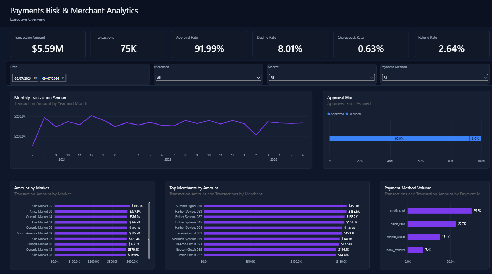
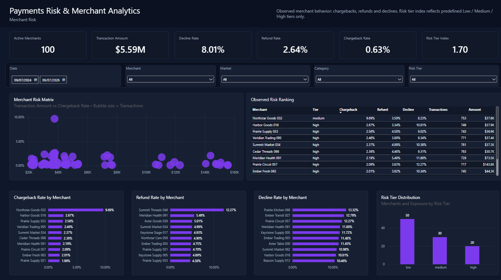
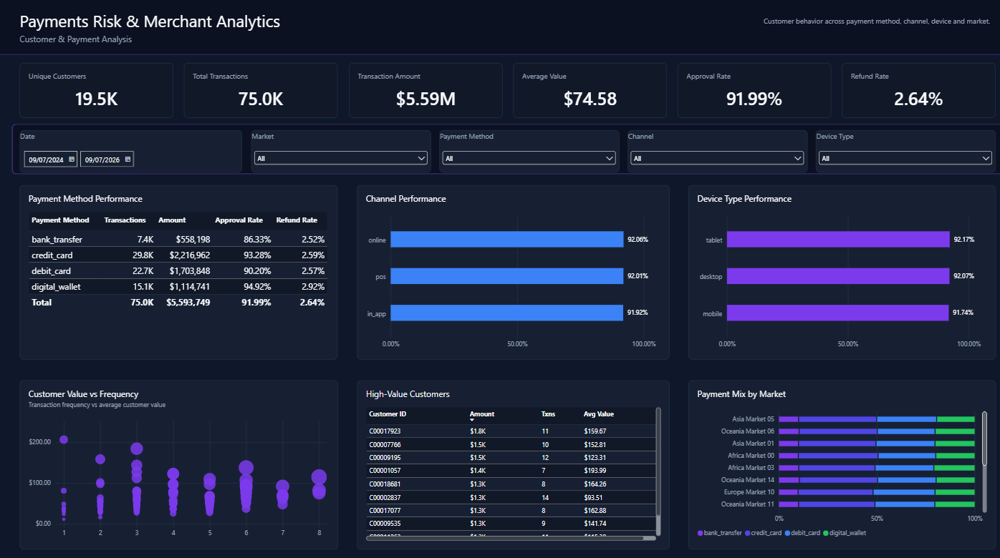

# Payments Risk & Merchant Analytics

Payments Risk & Merchant Analytics is an end-to-end analytics portfolio project for synthetic payments, merchant behavior, and reporting model validation. It demonstrates a full path from reproducible Python data generation through SQL Server dimensional modeling and a Power BI PBIP report with validated DAX measures.

The data is fully synthetic. Merchant, customer, market, payment, and risk-tier values were generated for this project and should not be interpreted as real financial institution activity or externally validated risk classifications.

## Dashboard Preview

### Executive Overview



The executive page summarizes portfolio transaction amount, volume, approval and decline behavior, refund rate, chargeback rate, monthly transaction amount, market performance, Top 10 merchants, and payment-method volume.

### Merchant Risk



The merchant risk page focuses on observed merchant behavior: chargeback, refund, and decline rates, exposure-aware ranking, merchant-level rate comparison, and the distribution of the synthetic predefined RiskTier metadata.

### Customer & Payment Analysis



The customer and payment page compares payment methods, channels, devices, customer value versus frequency, Top 10 high-value customers, and payment-method mix by market.

## Project Overview

This project models a synthetic payments portfolio with 75,000 transactions across 20,000 generated customers, 100 synthetic merchants, 15 generated markets, and a transaction date range from 2024-07-09 through 2026-07-09. The dimensional warehouse includes unknown-member records for the customer, merchant, geography, date, payment method, and transaction status dimensions.

The Power BI report is stored as a PBIP project so the report definition, semantic model, PBIR layout files, and TMDL model files can be reviewed in Git. Raw generated CSV files are intentionally excluded from version control and can be regenerated from the Python source.

## Business Questions

- What is the current synthetic payments portfolio size, transaction value, approval rate, refund rate, and chargeback rate?
- Which markets, merchants, and payment methods drive the largest transaction exposure?
- Which merchants show elevated observed chargeback, refund, or decline behavior?
- How do payment method, channel, and device type differ in volume, value, and approval behavior?
- Which customers account for the highest synthetic transaction value?

## Architecture

```text
Synthetic CSV generation
        |
Python validation
        |
SQL Server staging
        |
Dimensional ETL
        |
Star-schema warehouse
        |
Power BI semantic model / DAX
        |
Interactive dashboards
```

The implementation uses Python to generate and validate synthetic source files, SQL Server 2022 Developer for staging and dimensional modeling, and Power BI Desktop for the semantic model and report layer. Power BI imports the warehouse tables from `localhost` / `PaymentsRiskAnalytics`.

## Data Model

The warehouse follows a star schema centered on `dw.FactTransactions`, with one row per payment transaction attempt.

Dimensions:

- `dw.DimCustomer`
- `dw.DimDate`
- `dw.DimGeography`
- `dw.DimMerchant`
- `dw.DimPaymentMethod`
- `dw.DimTransactionStatus`

Fact:

- `dw.FactTransactions`

The Power BI semantic model imports the dimensional tables in Import mode and defines validated measures for transaction volume, transaction amount, approval and decline behavior, refunds, chargebacks, active merchants, unique customers, and selected time-intelligence calculations.

## Dashboard Pages

### Executive Overview

- Headline KPI cards for transaction amount, transactions, approval rate, decline rate, chargeback rate, and refund rate.
- Monthly transaction amount trend; incomplete July 2026 is intentionally excluded from the monthly executive trend.
- Approval versus decline mix, market performance, Top 10 merchants, and payment-method volume.
- Date, merchant, market, and payment-method filtering.

### Merchant Risk

- Observed chargeback, refund, and decline behavior by merchant.
- Merchant risk matrix and observed-risk ranking.
- Merchant-specific rate analysis and predefined synthetic RiskTier distribution.
- Date, merchant, market, merchant category, and RiskTier filtering.

`Merchant Risk Tier Index` is only a numeric representation of the predefined synthetic `RiskTier` metadata:

- Low = 1
- Medium = 2
- High = 3

It is not a behavioral risk score derived from chargebacks, refunds, declines, or any external risk model.

### Customer & Payment Analysis

- Payment method performance by volume, amount, approval rate, and refund rate.
- Channel and device approval performance.
- Customer value versus transaction frequency.
- Top 10 high-value customers by transaction amount.
- Payment-method mix by market.

## Key Metrics

Validated baseline metrics for the full synthetic portfolio:

| Metric | Value |
| --- | ---: |
| Transaction Amount | $5,593,748.99 |
| Transactions | 75,000 |
| Approval Rate | 91.99% |
| Decline Rate | 8.01% |
| Refund Rate | 2.64% |
| Chargeback Rate | 0.63% |
| Unique Customers Transacting | 19,538 |
| Active Merchants | 100 |

## Data Validation & QA

The project includes validation at the Python, SQL, and Power BI layers.

Verified checks include:

- 75,000 source transactions loaded to 75,000 fact rows.
- Zero orphan foreign keys in the fact table.
- Zero duplicate dimension surrogate/business keys for the tested dimensions.
- Transaction amount reconciliation between staging and warehouse.
- Refund amount and refund count reconciliation.
- Chargeback amount and chargeback count reconciliation.
- Power BI DAX measures reconciled to SQL baseline values.
- Slicer and filter behavior manually validated across the three production report pages.
- Python validation and pytest checks passed for generated row counts, foreign keys, payment rules, and injected anomaly behavior.

The validation suite also covers required field completeness, negative financial values, refund and chargeback consistency, approval/decline status rules, and date-key consistency across the generated data, warehouse, and semantic model checks.

## Tech Stack

- Python
- pandas
- SQL Server 2022 Developer
- T-SQL
- Power BI Desktop
- DAX
- Power Query
- PBIP / PBIR / TMDL
- pytest
- Git / GitHub

## Repository Structure

```text
sql/                  SQL Server database, staging load, dimensional ETL, reporting views, and validation scripts
python/               Synthetic data generator, configuration, validation script, and pytest tests
powerbi/              Power BI PBIP project source, report definition, semantic model, DAX notes, and theme assets
docs/                 Architecture documentation
assets/screenshots/   Dashboard screenshots used by this README
```

Generated raw CSV files, local Power BI cache folders, PBIX binaries, backups, and local development artifacts are intentionally excluded from Git.

## Running the Project

### 1. Install Python dependencies

```powershell
python -m venv .venv
.\.venv\Scripts\Activate.ps1
pip install -r requirements.txt
```

### 2. Generate the synthetic CSV files

```powershell
python python/generator/generate_data.py
```

This creates:

- `data/raw/merchants.csv`
- `data/raw/customers.csv`
- `data/raw/countries.csv`
- `data/raw/transactions.csv`

### 3. Validate the generated CSV files

```powershell
python python/validation/validate_generated_data.py
pytest python/tests
```

### 4. Create and load the SQL Server warehouse

The canonical SQL execution order uses the top-level scripts below:

```powershell
sqlcmd -S localhost -i sql/01_create_database.sql
sqlcmd -S localhost -d PaymentsRiskAnalytics -i sql/02_create_tables.sql
sqlcmd -S localhost -d PaymentsRiskAnalytics -i sql/03_load_csvs.sql -v CsvPath="C:/path/to/payment-risk-merchant-analytics/data/raw/"
sqlcmd -S localhost -d PaymentsRiskAnalytics -i sql/04_load_dimensions_and_fact.sql
sqlcmd -S localhost -d PaymentsRiskAnalytics -i sql/05_create_views.sql
sqlcmd -S localhost -d PaymentsRiskAnalytics -i sql/06_validation_queries.sql
sqlcmd -S localhost -d PaymentsRiskAnalytics -i sql/07_apply_display_labels.sql
sqlcmd -S localhost -d PaymentsRiskAnalytics -i sql/tests/10_data_quality_checks.sql
sqlcmd -S localhost -d PaymentsRiskAnalytics -i sql/tests/11_reconciliation_tests.sql
```

`sql/03_load_csvs.sql` requires the `CsvPath` sqlcmd variable. Use a path that the SQL Server service account can read; `BULK INSERT` runs from SQL Server's perspective, not from the PowerShell client process.

### 5. Open the Power BI report

Open the PBIP project in Power BI Desktop:

```text
powerbi/PaymentsRiskAnalytics.pbip
```

Refresh the imported model against `localhost` and database `PaymentsRiskAnalytics` using Windows authentication.

## Data & Assumptions

- All data is synthetic and reproducible from the Python generator.
- Generated markets use synthetic labels and should not be treated as real country activity.
- Generated merchants and customers are fictional.
- The predefined `RiskTier` field is synthetic metadata created by the generator.
- Observed risk visuals use validated behavioral measures such as chargeback rate, refund rate, decline rate, and transaction exposure.
- Raw CSV outputs are excluded from Git to keep the repository lightweight and reproducible.

## What This Project Demonstrates

- Reproducible synthetic data generation for a payments analytics scenario.
- Validation of generated entities, transaction rules, and intentionally injected anomaly behavior.
- SQL Server staging, dimensional modeling, ETL, and reconciliation testing.
- A Power BI semantic model with validated DAX measures over a star schema.
- PBIP/PBIR/TMDL source-controlled report development.
- Executive, merchant-risk, and customer/payment dashboard design using a consistent enterprise BI visual system.

## Future Enhancements

- Add a documented screenshot refresh process for the final dashboard images.
- Add CI checks for Python tests and SQL linting where a SQL Server test environment is available.
- Extend SQL run documentation with environment-specific notes for SQL Server service-account file access.
